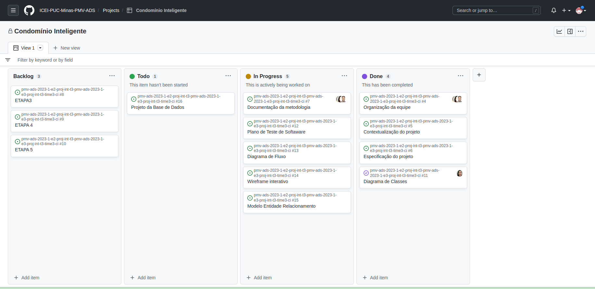

# Metodologia

Pré-requisitos: <a href="2-Especificação do Projeto.md"> Documentação de Especificação</a>

3. Metodologia

A metodologia contempla as definições de ferramental utilizado pela equipe tanto para a manutenção dos códigos e demais artefatos quanto para a organização do time na execução das tarefas do projeto.

## Relação de Ambientes de Trabalho

Os artefatos do projeto são desenvolvidos a partir de diversas plataformas e a relação dos ambientes com seu respectivo propósito é apresentada na tabela que se segue.  

Ambiente  |Plataforma  | Link de Acesso|
|------|-----------------------------------------|----|
|Repositório de código fonte|GitHub | https://github.com/ICEI-PUC-Minas-PMV-ADS/pmv-ads-2023-1-e2-proj-int-t3-pmv-ads-2023-1-e3-proj-int-t3-time3-ci| 
|Documentos do projeto|Google Drive | https://drive.google.com/drive/u/1/folders/195grl54t2GMdTbW6Zq-yvgbFsO1S_rWc |
|Projeto de Interface e  Wireframes|O sistema deve permitir o cadastro de usuários e moradias | ALTA |
|Gerenciamento do Projeto|GitHub | https://github.com/orgs/ICEI-PUC-Minas-PMV-ADS/projects/284 |

		 
## Gerenciamento do Projeto

- A equipe utiliza metodologias ágeis, tendo escolhido o Scrum como base para definição do processo de desenvolvimento./

A equipe está organizada da seguinte maneira:

- Scrum Master: Jonathan Costa
- Product Owner: Talita Pereira
- Equipe de Desenvolvimento
- Renato Freitas
- Renner Júnior

  Equipe de Design
  
- Nayara de Araújo

- A organização e distribuição das tarefas do projeto se dará por meio de reuniões de Sprints com apoio da organização em quadro Kanban armazenado eletronicamente no site do GitHub Project.  Deste modo, cada membro do time, será responsável por atualizar o status da sua tarefa. A seguir, é apresentado os conceitos metodológicos para o andamento das atividades:  

> - Backlog: recebe as tarefas a serem trabalhadas e representa o Product Backlog. Todas as atividades identificadas no decorrer do projeto também devem ser incorporadas a esta lista.

> - To Do: apresenta a lista de atividades identificadas e priorizadas pela equipe de desenvolvimento. Nela, apresenta todas as funcionalidades apresentadas pelo Product Backlog.

> - Doing: Quando uma tarefa tiver sido iniciada, ela é movida para cá. Esta lista representa quais as atividades estão sendo realizadas, de acordo com a Sprint determinada para o desenvolvimento. Apresentando uma cópia fiel do que está sendo trabalhado.

> - Done: nesta lista são colocadas as tarefas que passaram pelos testes e controle de qualidade e estão prontos para serem entregues ao usuário. Não há mais edições ou revisões necessárias, a tarefa está pronta.

- A funcionalidade de quadro Kanban disponível na ferramenta do GitHUb foi utilizada pelo grupo como ferramenta de gerenciamento de projetos e está disponível através da URL Quadro de Gerenciamento de Projetos e é apresentado, no estado atual, na Figura 1. 

## Diagrama de Classes

- Em UML, diagramas de classes são um de seis tipos de diagrama estrutural. Os diagramas de classe são fundamentais para o processo de modelagem de objetos e modelam a estrutura estática de um sistema. Dependendo da complexidade de um sistema, é possível utilizar um único diagrama de classe para modelar um sistema inteiro ou vários diagramas de classe para modelar os componentes de um sistema.
Os diagramas de classe são as cópias do sistema ou subsistema. Você pode utilizar os diagramas de classe para modelar os objetos que compõem o sistema, para exibir os relacionamentos entre os objetos e para descrever o que esses objetos fazem e os serviços que eles fornecem.

## Projeto de Interface

Dentre as preocupações para a montagem da interface do sistema, estamos estabelecendo foco em questões como agilidade, acessibilidade e usabilidade. Desta forma, o projeto tem uma identidade visual padronizada em todas as telas que são projetadas para funcionamento na web e em dispositivos móveis.

- Fluxo do Usuário
- 
O diagrama apresentado na Figura 2 mostra o fluxo de interação do usuário com o sistema.

## Wireframes

Conforme fluxo de telas do projeto, apresentado no item anterior, as telas do sistema são apresentadas em detalhes. As telas do sistema apresentam uma estrutura comum que é apresentada na Figura 3. Nesta estrutura, existem 4 blocos, descritos a seguir. São eles:

## Plano de Testes de Software

- O teste de software geralmente é a última etapa na construção de um programa, visando checar o seu nível de qualidade. Os defeitos que um teste busca identificar incluem erro de compatibilidade, de algum algoritmo, de requisitos que não podem ser complementados, limitação de hardware etc. A lista é grande e aumenta com o tamanho do programa.

| ID        | Funcionalidade (teste usuário) |Entrada de funcionalidade (como executar)             |Saída esperada |Registro de teste (o que aconteceu descrição) |Evidência |
|-----------|------------------------------------|----------------------|--------------|----------------|-------------------|
|RF-01    |Cadastro de moradias         | Com o usuário master já logado, na página principal, será possível acessar o menu cadastros/moradia e realizar cadastro da moradia.              | Cadastro da moradia realizado com sucesso||||
|RF-01 |Cadastro de moradias          |Caso o usuário logado seja diferente de master o menu cadastros não será apresentado.                | Menu de cadastro de moradias não será apresentado. ||||
|RF-01 |Cadastro de usuários          |Com o usuário master já logado, na página principal, será possível acessar o menu cadastros/usuários e realizar cadastro de usuários.                | Cadastro de usuário realizado com sucesso. ||||
|RF-01	 |Cadastro de usuários          |Cadastro de usuário realizado com sucesso.              | Menu de cadastro de usuário não será apresentado.  ||||
|RF-02  |Validação de cadastro          |Com o usuário master já logado, será possível validar uma auto cadastro do usuário proprietário.                | Cadastro validado com sucesso. ||||
|RF-02  |Validação de cadastro         |Caso o usuário logado seja diferente de master não será apresentada a opção de validar cadastro.              | Solicitação de validação não será apresentado ||||
|RF-02  |Auto cadastro do usuário proprietário.           |O usuário poderá preencher o menu de cadastro do tipo proprietário para posterior validação pelo usuário master.                | Solicitação de cadastro de proprietário enviada com sucesso para validação. ||||
|RF- 03  |Agendamento de reuniões          |Com o usuário master logado, será possível agendar o menu de reuniões e realizar o agendamento.              | Agendamento de reunião realizado com sucesso. ||||
|RF- 03  |Agendamento de reuniões         |Caso o usuário logado seja diferente do usuário master não será exibido o menu de agendamento de reuniões.                | Menu de agendamento de reuniões não será exibido.  ||||
|RF- 03 |Alerta de reuniões           |O usuário proprietário deve receber uma alerta toda vez que uma reunião for agendada               | Alerta de reunião enviados aos usuários proprietários ||||
|RF- 04 |Cadastro de documentos/ ata de reuniões.           |Com o usuário master logado, será possível acessar o menu reunião e cadastrar documentos/ ata relacionados.                | Cadastro de Documentos/ata da reunião realizados com sucesso.  ||||
|RF- 04 |Cadastro de documentos/ ata de reuniões.          |Caso o usuário logado não seja do tipo master não será possível acessar o menu reunião e cadastrar documentos/ ata relacionados.                | Menu reunião não será apresentado.  ||||
|RF- 04 |Visualização de documentos cadastrados          |Com o usuário proprietário logado será possível ter acesso ao menu documentos cadastrados.                | Menu de documentos cadastrados será exibido.||||
|RF- 04 |Visualização de documentos cadastrados          |Caso o usuário proprietário não esteja logado não será possível ter acesso ao menu documentos cadastrados.               | Menu de documentos cadastrados não será exibido. ||||
|RF-05  |Registro de recebimento de encomendas           |Com o usuário porteiro logado, será possível acessar o menu recebimento de encomenda, registrá-la e associá-la à moradia específica               | Menu recebimento será exibido.  ||||
|RF-05  |Registro de recebimento de encomendas          |Caso o usuário porteiro não esteja logado, não será possível acessar o menu recebimento.                | Menu recebimento não será exibido.  ||||
|RF-05  |Armazenamento de foto da encomenda recebida           |Com o usuário porteiro logado, após o registro de encomenda e associação à moradia específica será apresentado o botão para armazenamento de foto.               | Botão para armazenar foto será exibido.  ||||
|RF-05  |Armazenamento de foto da encomenda recebida           |Com o usuário porteiro logado, caso não seja feito o registro de encomenda e associação à moradia específica não será apresentado o botão para armazenamento de foto.               | Botão para armazenar foto não será exibido.  |||||
|RF-06      |O usuário proprietário deve receber um alerta toda vez que uma encomenda for registrada à sua moradia associada.                | Alerta de encomenda recebida enviada ao usuário proprietário.  |Alerta de encomenda recebida  |||
|RF-07  |Cadastro de áreas comuns          |Com o usuário master logado, será apresentado o menu áreas comuns.               | Área comum cadastrada com sucesso.||||
|RF-07  |Cadastro de áreas comuns          |Caso o usuário logado seja diferente de master o menu área comum não será apresentado.                 | Menu área comum não será apresentado.  ||||
|RF-08 |Solicitação de reserva de área comum          |Com o usuário proprietário logado será possível cadastrar um pedido de reserva de área comum.               | Reserva de área comum foi solicitada com sucesso. Aguarde aprovação.  ||||
|RF-08 |Solicitação de reserva de área comum          |Caso o usuário proprietário não esteja logado não será possível cadastrar um pedido de reserva de área comum.               | Menu de reserva de área comum não será apresentado.  ||||	
|RF-08 |Aprovação de reserva de área comum           |Com o usuário master logado, será possível aprovar ou recusar reserva de área comum.               | Solicitação de reserva foi aprovada ou recusada.  ||||
|RF-08 |Aprovação de reserva de área comum          |Caso o usuário logado seja diferente de master, não será possível aprovar ou recusar reserva de área comum.                | Solicitação de aprovação de reserva não será exibida. ||||

## Controle de Versão

A ferramenta de controle de versão adotada no projeto foi o
[Git](https://git-scm.com/), sendo que o [Github](https://github.com)
foi utilizado para hospedagem do repositório.

O projeto segue a seguinte convenção para o nome de branches:

- `main`: versão estável já testada do software
- `unstable`: versão já testada do software, porém instável
- `testing`: versão em testes do software
- `dev`: versão de desenvolvimento do software

Quanto à gerência de issues, o projeto adota a seguinte convenção para
etiquetas:

- `documentation`: melhorias ou acréscimos à documentação
- `bug`: uma funcionalidade encontra-se com problemas
- `enhancement`: uma funcionalidade precisa ser melhorada
- `feature`: uma nova funcionalidade precisa ser introduzida

Discuta como a configuração do projeto foi feita na ferramenta de versionamento escolhida. Exponha como a gerência de tags, merges, commits e branchs é realizada. Discuta como a gerência de issues foi realizada.

> **Links Úteis**:
> - [Tutorial GitHub](https://guides.github.com/activities/hello-world/)
> - [Git e Github](https://www.youtube.com/playlist?list=PLHz_AreHm4dm7ZULPAmadvNhH6vk9oNZA)
>  - [Comparando fluxos de trabalho](https://www.atlassian.com/br/git/tutorials/comparing-workflows)
> - [Understanding the GitHub flow](https://guides.github.com/introduction/flow/)
> - [The gitflow workflow - in less than 5 mins](https://www.youtube.com/watch?v=1SXpE08hvGs)

## Gerenciamento de Projeto

### Divisão de Papéis

Apresente a divisão de papéis entre os membros do grupo.

> **Links Úteis**:
> - [11 Passos Essenciais para Implantar Scrum no seu 
> Projeto](https://mindmaster.com.br/scrum-11-passos/)
> - [Scrum em 9 minutos](https://www.youtube.com/watch?v=XfvQWnRgxG0)

### Processo

Coloque  informações sobre detalhes da implementação do Scrum seguido pelo grupo. O grupo poderá fazer uso de ferramentas on-line para acompanhar o andamento do projeto, a execução das tarefas e o status de desenvolvimento da solução.
 
> **Links Úteis**:
> - [Project management, made simple](https://github.com/features/project-management/)
> - [Sobre quadros de projeto](https://docs.github.com/pt/github/managing-your-work-on-github/about-project-boards)
> - [Como criar Backlogs no Github](https://www.youtube.com/watch?v=RXEy6CFu9Hk)
> - [Tutorial Slack](https://slack.com/intl/en-br/)

### Ferramentas

As ferramentas empregadas no projeto são:

- Editor de código.
- Ferramentas de comunicação
- Ferramentas de desenho de tela (_wireframing_)

O editor de código foi escolhido porque ele possui uma integração com o
sistema de versão. As ferramentas de comunicação utilizadas possuem
integração semelhante e por isso foram selecionadas. Por fim, para criar
diagramas utilizamos essa ferramenta por melhor captar as
necessidades da nossa solução.

Liste quais ferramentas foram empregadas no desenvolvimento do projeto, justificando a escolha delas, sempre que possível.
 
> **Possíveis Ferramentas que auxiliarão no gerenciamento**: 
> - [Slack](https://slack.com/)
> - [Github](https://github.com/)
